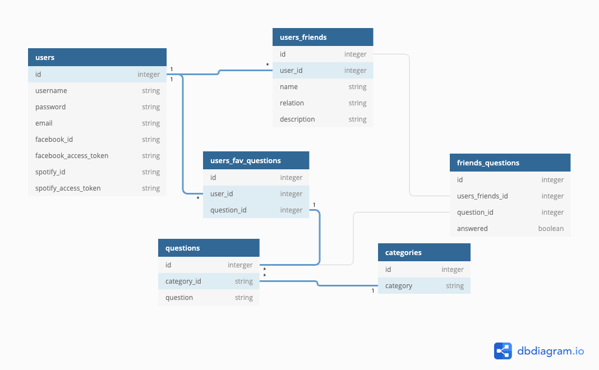

# Weekly Assignment Three :rocket:

## Purpose :dark_sunglasses:

The purpose of this repository is to follow along with the current cohort's weekly assignment - to be explicit about the steps in creating a fullstack web application, and to model the potential difficulties one could run into. 

## End Goal

 Now "success" is a relative term and may vary from person to person.

I determined that a "successful" application to mean the following:

- I would have become a more competent software engineer. 
  - Good coding practices: comments
  - Setting sprints 
  - Debug well 
  - Really understand the fullstack web application process
- It would have to be engaging, interesting, and meaningful for at least 1 person.

### How to run this package

```
npm install
```

```
node app.js
```

### How it works :open_book:

- [ ] Handlebars 
  - [ ] Categories
  - [ ] Profile
  - [ ] Question 
  - [ ] About
  - [ ] 
- [ ] Controller: 
  - [ ] Router 

- [ ] Model 
  - [x ] friends.json 
  - [ x] orders.json
  - [ x] questions_family.json
  - [x ] questions_friends.json
  - [x ] questions_love.json
  - [ x] questions_work.json 
    - The question 
    - [ ] Grab modal from the MDBootstrap 
    - [ ] See if you can have an arrow that just clicks through a bunch of data points, like a modal sort of thing? 
    - [ ] You also want to add a button to see if you can favorite the question 
    - [ ] Create that for every page 
  - [ ] categories.json
    - [ ] Will be linked to the modal, so technically there might not be a question page 
  - [ ] users.json 
    - This will contain the list of authorized users 
### Where it fits :paperclip:

- [ ] Fullstack Application Web Development
- [ ] Model-View-Controller
- [ ] Data Manipulation  
- [ ] 
- [ ] Postgres

## Important Vocabulary

| Word | Where it occurs | How it works |
| ---- | :-------------: | :----------: |
| Word |                 |              |

### User Stories :telescope:

1. Users will be able to look through the various examples and understand how to develop a web application well.
2. Users will be able to follow along the checklist and accurately complete the web application. 
 

## Sprint :athletic_shoe:

| Done? | Component              | Priority | Estimated Time | Actual Time |
| ----- | ---------------------- | :------: | :------------: | :---------: |
| x     | Complete JSON Files (Data)         |    H     |       |             |
|       | Create frontend and implement event handlers     |    M     |    30 mins     |             |
|       | Create app.js | 30 mins  |                |
|       | Install all needed packages  |    M     |    30 mins     |     15      |

Documentation: 

### Daily Stand Up :hourglass:

| Date | What I did yesterday              | Today | Obstacles | Comments |
| ----- | ---------------------- | :------: | :------------: | :---------: |
| Oct 21   | Finished marking student exercises        |    Work on implementing the checklist for this assignment, continue commenting through the application and playing around with it - Zuckerberg said to break things    |       |             |
|    Oct 22   |      |    M     |    30 mins     |             |
|  Oct 23     | Look at three examples | Finished writing migrations and planning out tables |                |
|  Oct 24     |   |    M     |    30 mins     |     15      |
|  Oct 25     |   |    M     |    30 mins     |     15      |
|  Oct 26     |   |    M     |    30 mins     |     15      |
|  Oct 27     |   |    M     |    30 mins     |     15      |
|  Oct 28    |   |    M     |    30 mins     |     15      |
|  Oct 29     |   |    M     |    30 mins     |     15      |
|  Oct 30     |   |    M     |    30 mins     |     15      |
|  Oct 31     |   |    M     |    30 mins     |     15      |

## Issues and Resolutions :flashlight:

**ERROR**: :gear:
**RESOLUTION**: :key:

| Issue                | Where it occurs | Possible solution | Actual solution |
| -------------------- | :-------------: | :---------------: | :-------------: |
| Creating a checklist |        H        |       2hrs        |     2.5hrs      |

#### What is one thing that I learned from doing this project? :books:

#### Credits :recycle:

[Jest](https://jestjs.io/)

#### Contributing :round_pushpin:

Pull requests are welcome. For major changes, please open an issue first to discuss what you would like to change.
Not sure how? Learn [Github](https://www.youtube.com/watch?v=3RjQznt-8kE&list=PL4cUxeGkcC9goXbgTDQ0n_4TBzOO0ocPR)
Please make sure to update tests as appropriate.

#### License :memo:

[MIT](https://choosealicense.com/licenses/mit/)

To Do List

Purpose: 
To set up the backend routes (just to make sure that it can communicate with the backend)

Need to test the kind of data that is going into and out of the backend 

SIGNUP

Element: 

- [ ] Open postgres 
- [ ] Create migration files 
- [ ] Create seed files
- [ ] Render the data onto index.handlebars
- [ ] Create and verify user table
- [ ] Create and verify user_friend table 
- [ ] Create and verify category table 
- [ ] Create and verify question table
- [ ] Create and verify user_fav_question table
- [ ] Create and verify user_friend_all_questions table 

PSEUDO CODE 
- [ ] User Table 
  - [ ] UserService class 


    - [ ] Add user (signup)

      - [ ] Service: addUserService(user)
        - [ ] Incoming data: user object
        - [ ] throw new error otherwise  
        - [ ] Knex command works
        - [ ] Postgres check 


### User Stories ### 
- [ ] Users will be able to signup and login
- [ ] Users will be able to edit their information
- [ ] Users will be able to delete their account  

## Main Characters ## 
user {
    id
    email
    password
    facebook_id
    facebook_access_token
    spotify_id
    spotify_access_token
    timestamp
}

##### OUTLINE OF ESSAY ######
- Router Methods: 
  - [ ] getAllUsersRoute("/api/user", (incoming, outgoing))
    - getAllUsersService()
  - [ ] getUserRoute("api/user/:userId", (incoming, outgoing))
    - incoming: incoming.param.userId, incoming.auth.user
    - getUserService(id, user)
    - outgoing: outgoing.json(user)
  - [ ] addUserRoute("/signup", (incoming, outgoing))
  - [ ] editUserRoute("api/user/:id", (incoming, outgoing)) 
  - [ ] deleteUserRoute("api/user/:id", (incoming, outgoing))

- Service Method Names:
  - getAllUsersService()
  - getUserService(id, user)
  - addUserService(user)
  - editUserService(id, user)
  - deleteUserService (id, user)

#### User Stories #### 
- Users will be able to add a new friend
- Users will be able to edit a friend
- Users will be able to delete a friend
- Users will be able to get a friend's profile

#### Setting of Story ####
user table 
```
user {
    id
    email
    password
    facebook_id
    facebook_access_token
    spotify_id
    spotify_access_token
    timestamp
}
```
user_friend table
```
user_friend {
    id
    user_id (foreign)
    name
    emoji
    wishful_city
    fav_memory 
    timestamp
}
```

#### Outline of Story #####
- Router Methods: 
  - addFriendRoute("/api/friend/", (incoming, outgoing))
  - getFriendRoute("/api/friend/:id", (incoming, outgoing))
  - editFriendRoute("/api/friend/:id", (incoming, outgoing))
  - deleteFriendRoute("/api/friend/:id", (incoming, outgoing))


- Service Method Names:
  - getAllFriendsService(user)
  - addFriendService(friend, user)
  - getFriendService(friendId, user)
  - editFriendService(friendId, friend, user)
  - deleteFriendService(friendId, user)

### User Stories ### 
- Users will be able to click on play, upon landing on friend profile page. 
- Users will be able to choose a category after clicking play. 
- Users will first land on rules page, then commence with the question of that category. 
- Users will be able to favorite a particular question. 
- Users will be able to click on next, and upon doing so, activate that specific question as answered. 

## Main Characters ## 
```
user {
    id
    email
    password
    spotify_id
    spotify_access_token
    timestamp
}
```
category table 
```
category {
    id
    name
    timestamp
}
```
```
user_friend {
    id
    user_id (foreign)
    name
    emoji
    wishful_city
    fav_memory 
    timestamp
}
```
```
question {
    id
    category_id
    question_string
    photo_url
    timestamp
}
```
```
user_friend_all_questions {
    id
    user_id
    user_friend_id
    question_id
    answered
    timestamp
}
```
##### Essay Outline ######
- Router Methods: 
  - getAllQuestionsRoute("/api/questions/")
  - getAllQuestionsFromCategoryRoute("/api/questions/:category", (incoming, outgoing))
    - incoming data: incoming.query.category, incoming.body.friend, incoming.auth.user
    - outgoing: outgoing.json(an array of questions?)
  - getQuestionRoute("/api/question/:id", (incoming, outgoing))
  - editQuestionRoute("/api/question/:id", (incoming, outgoing))

- Service Method Names:
  - getAllQuestionsService
    - get all questions
  - getAllQuestionsFromCategoryService(category, friend, user)
    - loop through user_friend_all_questions
    - return all that are marked answered: false
  - getQuestionService(id)
    - Return that question  
  


#### Outline of Story #####
- Users will be able to favorite a particular question. 
```
user {
    id
    email
    password
    spotify_id
    spotify_access_token
    timestamp
}
```
```
question {
    id
    category_id
    question_string
    photo_url
    timestamp
}
```
```
user_fav_question {
    id
    user_id (foreign)
    question_id (foreign)
    timestamp 
}
```
##### Essay OUtline ######
- Router Methods: 
  - getCategoriesRoute("/api/friend/", (incoming, outgoing))
- Service Method Names:
  - markAsFavoriteQuestionService(user, ques)


// NEED TO CHECK THIS 

        - [ ] Outgoing data: outgoing.json()
      - [ ] Knex command works
      - [ ] Postgres check 
      - [ ] Router: 
      - [ ] Incoming route: 
      - [ ] Incoming data:  
      - [ ] Outgoing route: 
      - [ ] Outgoing data:


    - [ ] Get user 
      - [ ] Service: getUserService("/:id")
      - [ ] Route: getUserRoute 
      - [ ] Knex command works
      - [ ] Postgres check 
      - [ ] Router: 
      - [ ] Incoming route:
      - [ ] Incoming data:  
      - [ ] Outgoing route: 
      - [ ] Outgoing data:
    - [ ] List users 
      - [ ] Service: 
      - [ ] Knex command works
      - [ ] Postgres check 
      - [ ] Router: 
      - [ ] Incoming route:
      - [ ] Incoming data:  
      - [ ] Outgoing route: 
      - [ ] Outgoing data:
    - [ ] Delete user (when user wants to delete their account)
      - [ ] Service: getAllUserFriendsService
      - [ ] Knex command works
      - [ ] Postgres check 
      - [ ] Router: 
      - [ ] Incoming route:
      - [ ] Incoming data:  
      - [ ] Outgoing route: 
      - [ ] Outgoing data:
    - [ ] Edit user (if user wants to edit their profile)
      - [ ] Service: getAllUserFriendsService
      - [ ] Knex command works
      - [ ] Postgres check 
      - [ ] Router: 
      - [ ] Incoming route:
      - [ ] Incoming data:  
      - [ ] Outgoing route: 
      - [ ] Outgoing data: 

- [ ] user_friend table
  - [ ] UserFriendService class
    - [ ] Get all of the user's friends
      - [ ] Method name: getAllUserFriendsService 
      - [ ] 
      - [ ] Knex command works
      - [ ] Postgres check 
      - [ ] Incoming route:
      - [ ] Incoming data:  
      - [ ] Outgoing route: 
      - [ ] Outgoing data:  

      - [ ] Service: getAllUserFr
        - [ ] Incoming data: user object
        - [ ] throw new error otherwise  
        - [ ] Knex command works
        - [ ] Postgres check 

      - [ ] Router: addUserRoute(incoming, outgoing)
        - [ ] Incoming data: incoming.auth.user 

    - [ ] add user_friend (add new friend)
      - [ ] Service: getAllUserFriendsService
      - [ ] Knex command works
      - [ ] Postgres check 
      - [ ] Router: 
      - [ ] Incoming route:
      - [ ] Incoming data:  
      - [ ] Outgoing route: 
      - [ ] Outgoing data:
    - [ ] edit user_friend (edit friend)
      - [ ] Service: getAllUserFriendsService
      - [ ] Knex command works
      - [ ] Postgres check 
      - [ ] Router: 
      - [ ] Incoming route:
      - [ ] Incoming data:  
      - [ ] Outgoing route: 
      - [ ] Outgoing data:
    - [ ] delete user_friend (delete friend)
      - [ ] Service: getAllUserFriendsService
      - [ ] Knex command works
      - [ ] Postgres check 
      - [ ] Router: 
      - [ ] Incoming route:
      - [ ] Incoming data:  
      - [ ] Outgoing route: 
      - [ ] Outgoing data:
    - [ ] get user_friend (get friend)
      - [ ] Service: getAllUserFriendsService
      - [ ] Knex command works
      - [ ] Postgres check 
      - [ ] Router: 
      - [ ] Incoming route:
      - [ ] Incoming data:  
      - [ ] Outgoing route: 
      - [ ] Outgoing data:

- [ ] category table 
  - [ ] service class
    - [ ] get name from id
      - [ ] Service: getAllUserFriendsService
      - [ ] Knex command works
      - [ ] Postgres check 
      - [ ] Router: 
      - [ ] Incoming route:
      - [ ] Incoming data:  
      - [ ] Outgoing route: 
      - [ ] Outgoing data:

- [ ] question table  
  - [ ] Service class
    - [ ] get question from category
      - [ ] Service: getAllUserFriendsService
      - [ ] Knex command works
      - [ ] Postgres check 
      - [ ] Router: 
      - [ ] Incoming route:
      - [ ] Incoming data:  
      - [ ] Outgoing route: 
      - [ ] Outgoing data: 
    - [ ] favorite question 
      - [ ] Service: getAllUserFriendsService
      - [ ] Knex command works
      - [ ] Postgres check 
      - [ ] Router: 
      - [ ] Incoming route:
      - [ ] Incoming data:  
      - [ ] Outgoing route: 
      - [ ] Outgoing data:
    - [ ] mark question as answered 
      - [ ] Service: getAllUserFriendsService
      - [ ] Knex command works
      - [ ] Postgres check 
      - [ ] Router: 
      - [ ] Incoming route:
      - [ ] Incoming data:  
      - [ ] Outgoing route: 
      - [ ] Outgoing data:
    - [ ] get all questions 
      - [ ] Service: getAllUserFriendsService
      - [ ] Knex command works
      - [ ] Postgres check 
      - [ ] Router: 
      - [ ] Incoming route:
      - [ ] Incoming data:  
      - [ ] Outgoing route: 
      - [ ] Outgoing data:


- [ ] user_friend_all_questions 
  - [ ] service class
    - [ ] mark as true 
      - [ ] Service: getAllUserFriendsService
      - [ ] Knex command works
      - [ ] Postgres check 
      - [ ] Router: 
      - [ ] Incoming route:
      - [ ] Incoming data:  
      - [ ] Outgoing route: 
      - [ ] Outgoing data:
