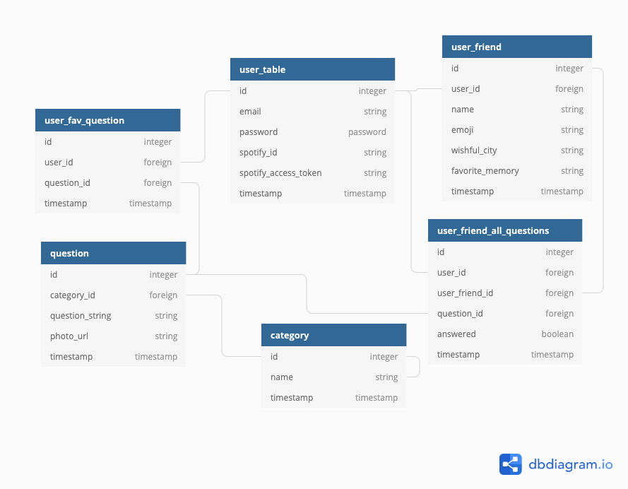

# Weekly Assignment Three :rocket:

## Purpose :dark_sunglasses:

The purpose of this repository is to follow along with the current cohort's weekly assignment - to be explicit about the steps in creating a fullstack web application, and to model the potential difficulties one could run into. 

## End Goal

 Now "success" is a relative term and may vary from person to person.

I determined that a "successful" application to mean the following:

- I would have become a more competent software engineer. 
  - Good coding practices: comments
  - Setting sprints 
  - Debug well 
  - Really understand the fullstack web application process
- It would have to be engaging, interesting, and meaningful for at least 1 person.

### How to run this package

```
npm install
```

```
node app.js
```

### How it works :open_book:

- [ ] Handlebars 
  - [ ] Categories
  - [ ] Profile
  - [ ] Question 
  - [ ] About
  - [ ] 
- [ ] Controller: 
  - [ ] Router 

- [ ] Model 
  - [x ] friends.json 
  - [ x] orders.json
  - [ x] questions_family.json
  - [x ] questions_friends.json
  - [x ] questions_love.json
  - [ x] questions_work.json 
    - The question 
    - [ ] Grab modal from the MDBootstrap 
    - [ ] See if you can have an arrow that just clicks through a bunch of data points, like a modal sort of thing? 
    - [ ] You also want to add a button to see if you can favorite the question 
    - [ ] Create that for every page 
  - [ ] categories.json
    - [ ] Will be linked to the modal, so technically there might not be a question page 
  - [ ] users.json 
    - This will contain the list of authorized users 
### Where it fits :paperclip:

- [ ] Fullstack Application Web Development
- [ ] Model-View-Controller
- [ ] Data Manipulation  
- [ ] 
- [ ] Postgres

## Important Vocabulary

| Word | Where it occurs | How it works |
| ---- | :-------------: | :----------: |
| Word |                 |              |

### User Stories :telescope:

1. Users will be able to look through the various examples and understand how to develop a web application well.
2. Users will be able to follow along the checklist and accurately complete the web application. 
 

## Sprint :athletic_shoe:

| Done? | Component              | Priority | Estimated Time | Actual Time |
| ----- | ---------------------- | :------: | :------------: | :---------: |
| x     | Complete JSON Files (Data)         |    H     |       |             |
|       | Create frontend and implement event handlers     |    M     |    30 mins     |             |
|       | Create app.js | 30 mins  |                |
|       | Install all needed packages  |    M     |    30 mins     |     15      |

Documentation: 

### Daily Stand Up :hourglass:

| Date | What I did yesterday              | Today | Obstacles | Comments |
| ----- | ---------------------- | :------: | :------------: | :---------: |
| Oct 21   | Finished marking student exercises        |    Work on implementing the checklist for this assignment, continue commenting through the application and playing around with it - Zuckerberg said to break things    |       |             |
|    Oct 22   |      |    M     |    30 mins     |             |
|  Oct 23     | Look at three examples | Finished writing migrations and planning out tables |                |
|  Oct 24     |   |    M     |    30 mins     |     15      |
|  Oct 25     |   |    M     |    30 mins     |     15      |
|  Oct 26     |   |    M     |    30 mins     |     15      |
|  Oct 27     |   |    M     |    30 mins     |     15      |
|  Oct 28    |   |    M     |    30 mins     |     15      |
|  Oct 29     |   |    M     |    30 mins     |     15      |
|  Oct 30     |   |    M     |    30 mins     |     15      |
|  Oct 31     |   |    M     |    30 mins     |     15      |

## Issues and Resolutions :flashlight:

**ERROR**: :gear:
**RESOLUTION**: :key:

| Issue                | Where it occurs | Possible solution | Actual solution |
| -------------------- | :-------------: | :---------------: | :-------------: |
| Creating a checklist |        H        |       2hrs        |     2.5hrs      |

#### What is one thing that I learned from doing this project? :books:

#### Credits :recycle:

[Jest](https://jestjs.io/)

#### Contributing :round_pushpin:

Pull requests are welcome. For major changes, please open an issue first to discuss what you would like to change.
Not sure how? Learn [Github](https://www.youtube.com/watch?v=3RjQznt-8kE&list=PL4cUxeGkcC9goXbgTDQ0n_4TBzOO0ocPR)
Please make sure to update tests as appropriate.

#### License :memo:

[MIT](https://choosealicense.com/licenses/mit/)
